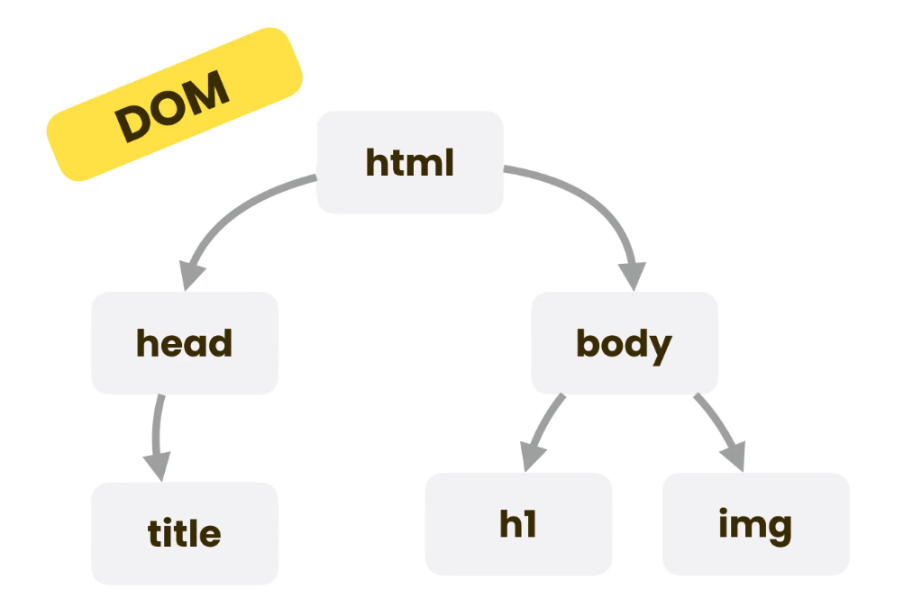
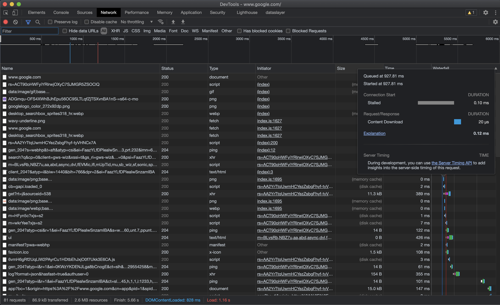
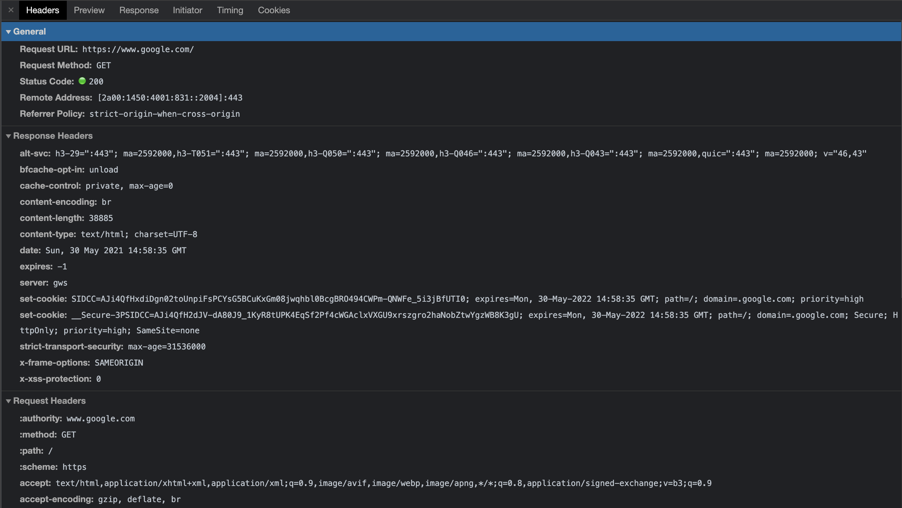

# Web development fundamentals

[Languages and tools of web development](#languages-and-tools-of-web-development)  
[How the web works](#how-the-web-works)  
[Requests and Responses](#requests-and-responses)  
[HTML](#html)  
[CSS](#css)  
[Validation](#validation)  

## Languages and tools of web development

Every web site has two parts: a **front-end** and **back-end**. The front-end is what the user sees in the browser and interacts with. The back-end is everything that happens behind the scenes so that the web page can do what it does. Developers who build both front and back-end systems are called **full-stack** developers.

To build front-end we use HTML, CSS, and JavaScript. **HTML** stands for *Hypertext Markup Language* and is used to defined the building blocks of the webpage. HTML is not a programming language, but a mark-up language. **CSS** stands for *Cascading Stylesheet* and is used to style the web page. It controls the aesthetics of the page. CSS is not a programming language either, but a styling language. **JavaScript** is used to control the behavior of the webpage and add functionality to it.

In order to build webpages faster, front-end developers use a variety of frameworks and libraries. Currently, the most popular ones are **React** (library), **Angular** (framework), and **Vue** (framework).

To build the back-end services that websites use, developers use a wide variety of tools. Some of the most popular programming languages are Java, Python, Go, C#, and much more.

## How the web works

The address that you type in the browser's address-bar is called a **URL** (*Uniform Resource Location*). A resource can be anything that is stored and accessible through the web like web pages (called HTML documents), images, video and audio files, fonts, etc. One you type an address in the address-bar and hit enter two actors start interacting. One the one side it's the **client** (your browser), on the other side is the **web server** (or server for short). This is why it's called the client-server model.

In this model, the client will request a service, and the server will provide that service. Requests for services are standardize and the clients use a format (or protocol) called **HTTP** (*Hypertext Transfer Protocol*). You can think of HTTP as the language that clients and servers use to talk to each other. Another version of this protocol is called **HTTPS** (*Hypertext Transfer Protocol Secure*). It's just like HTTP, but with encryption.

For example, here is the message that a browser would send to a server to request a webpage:

``` text
GET /index.html HTTP/1.1
Host: www.codewithmosh.com
Accept-Language: en-us
```

The first line is just telling the server that it wants to `GET` a file called `index.html` using `HTTP` version `1.1`. `index.html` usually represent the homepage of websites. The second line displays the `host`. And the third line tells the server that language that the client can accept.

Once the server receives the message, it will fetch the requested document and send it back to the client.

The message that the client sends to the server is called a **REQUEST**, and the message that the server sends to the client in called a **RESPONSE**. The response to our example request could look something like this:

``` text
HTTP/1.1 200 OK
Date: 1 Jan 2021 09:00
Content-Type: text/html

<!DOCTYPE html>
<html>
  ...
</html>
```

The first line shows the version of HTTP used followed by a status code. `200 OK` means that the message was successfully received. Then in the second line comes the date and time of the response. The third line tells the client what type of content it's sending. After that comes the actual content.

Once the browser gets the content of the message, it will construct a **DOM** (*Document Object Model*). This is just a tree that represent the elements in the HTML document.



As the browser is reading the document and building the DOM, it will discover references to other resources (like images, videos, etc). For each resource that it discovers, it will send an HTTP request to the server asking for the resource to be fetched. Many of the requests are sent in parallel so that the page loads faster.

Once the client has all the necessary resources, it will **Render** (display) the HTML document to the user.

## Requests and Responses

You can inspect all requests and responses sent between client and server in the **Network** tab of the DevTools. You should see something like this:



The network tab lists all the requests that were sent from the browser. At the bottom of the devtools you can see the total number of requests (in this case 81), as well as the total amount of data transferred over the network (86.9 kB). For each element in the list, the DevTools displays the name, the status, the total data transferred, the amount of time it took to get a response.

If you click on a request, you can see more details about it. In here we can see all the **Headers** of the request like the *Request URL*, *Request Method*, *Status Code*, *Remote Address* (the numeric representation of the URL), etc. After that we can see the **Response Headers** (i.e. what the server sent back).



Under the **Preview** tab you can see a preview of the servers response (in this case, the home page for Google). You can use the filter to search of only specific types of requests (like doc requests, or font requests, etc.).

## HTML

By convention, `index.html` represents the homepage of websites. An HTML document must always start with the document declaration `<!DOCTYPE html>`. This will tell the browser that the document that it's receiving is an HTML5 document.

HTML is not a case sensitive language, so `<!DOCTYPE html>` is the same as `<!doctype html>`. But the convention in the community is to type all elements with lowercase, except the doc-type declaration.

After the doc-type declaration we need to add the `<html></html>` element. Everything that we put in side the HTML tag is part of the page. Most HTML elements will require an opening tag, like `<html>`, and a closing tag, like `</html>`. Everything in between this tags will become a child element of the `<html>` element. Convention is to indent child elements with one two-space tab.

After the `<html>` element, we need to add two elements: `<head>`, and `<body>`. The `<head>` element will contain metadata about the web page, while the `<body>` element will contain all the elements that the user actually sees and interacts with. In the `<head>` element we'll include things like the `<title>` and links to `css` styling sheets. The `<head>` will be displayed in the browser as the title of the tab.

## CSS

CSS can be included in the `<head>` using the `<style>` element or directly in the HTML elements using the `style` attribute. But both this options are discouraged. Instead we add a `<link />` element to the `<head>` with the `rel="stylesheet"` attribute and `href`-it to our `style.css` file. Like so:

``` html
<head>
  <link rel="stylesheet" href="path_to_style.css" />
</head>
```

Each CSS block is called a **rule** and its composed of a series of `property: value` pairs called **declaration**. These rules tell the browser how a specific property of the HTML element should be rendered. We start each block by telling the browser which element the rules will target, and then write each rule in it's own line, ending each one with a semi-colon `;`.

``` css
img {
  width: 100px;
  border-radius: 50px;
}
```

Each HTML element can be given a **class** and/or an **id**. This makes targeting them in CSS rules easier and allows us to have rules that don't target all elements of the same type, but rather the same class. The same is true for IDs, only that IDs must be unique. No two elements can have the same ID. An element can have multiple classes, but only one ID. In order to tell the browser that a certain rule needs to apply only to a specific class we start the rule not with the element type, but with the class name_

``` css
.username {
  font-weight: bold;
}
```

If instead we want to target an ID, we start the rule with the ID:

``` css
#mosh {
  font-weight: bold;
}
```

## Validation

We can validate the HTML markup using the [W3 validator](https://validator.w3.org/). This will list the warnings and errors in our page. For CSS we use [Jigsaw](https://jigsaw.w3.org/css-validator/).
