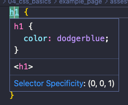
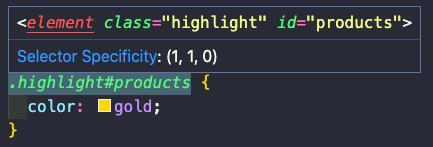

# CSS

[Providing CSS](#providing-css)  
[Normalizing CSS](#normalizing-css)  
[Basic selectors](#basic-selectors)  
[Relational selectors](#relational-selectors)  
[Pseudo-class selectors](#pseudo-class-selectors)  
[Pseudo-element selectors](#pseudo-element-selectors)  
[Selectors specificity](#selectors-specificity)  
[Inheritance](#inheritance)  
[Colors](#colors)  
[Gradients](#gradients)  
[Borders](#borders)  
[Shadows](#shadows)  

## Providing CSS

There are three different ways of providing CSS:

1. Embedded stylesheets: these are created by adding a `<style>` element in the `<head>` of an HTML document. The problem with this approach is that all CSS declarations need to be re coded into each HTML document that makes up our site. This is a maintenance hell! It also violates *Separation of concerns*.
2. External stylesheets: these involve creating a separate `.css` file and linking it to the web page by adding a `<link>` element in the `<head>` of an HTML document. The `<link>` element takes two attributes. The first one is `rel`, which defines the relationship between the HTML document and the asset we are linking to (in this case `stylesheet`). The second one is `href`, which provides the path to the asset we are linking to.
3. Inline styles: these are created by specifying the `style` attribute of an HTML element. These style declarations should be avoided. Use classes and ids instead.

> Precedence of CSS declarations: inline >> embedded stylesheets >> external stylesheets.

## Normalizing CSS

Different Browsers render HTML differently. To address this issue we use [Normalize.css](https://necolas.github.io/normalize.css/).

## Basic selectors

In CSS we can select elements for styling by: type (HTML tag), class, ID, or attributes. A selector is the first word of a CSS declaration (the one before the braces, `{}`). IDs must be unique. Only one element in the entire HTML document can have a given ID. Classes, on the other hand, can be re-used in multiple elements.

``` css
/* Selection by tag */
HTMLelement {
  rules: here;
}
```

``` css
/* Selection by ID */
#elementID {
  rules: here;
}
```

``` css
/* Selection by class */
.className {
  rules: here;
}
```

We can also select based on attributes. To do so, we include the attribute in square brackets. If we want to select elements where the attribute is equal to a certain value, we pass that value.

``` css
/* Select all anchors with a target attribute */
/* The value does not matter here */
a[target] {
  rules: here;
}
```

``` css
/* Select all anchors with its target attribute set to _blank */
a[target="_blank"] {
  rules: here;
}
```

``` css
/* Select all anchors with its href set to https://google.com */
a[href="https://google.com"] {
  rules: here;
}
```

``` css
/* Select all anchors with its href containing the word google */
a[href*="google"] {
  rules: here;
}
```

``` css
/* Select all anchors with its href starting with https */
a[href^="https"] {
  rules: here;
}
```

``` css
/* Select all anchors with its href ends with .com */
a[href$=".com"] {
  rules: here;
}
```

``` css
/* Select all anchors with its href starting with https and ending with .com */
a[href^="https"][href$=".com"] {
  rules: here;
}
```

## Relational selectors

We can also select elements based on their relationship to other elements. We can create descendant selectors like so

```css
#products p {
  rules: here;
}
```

This will apply all rules to all the `<p>` elements inside the element with id `products`. This includes `<p>` elements that have the `products` element as an ancestor, but not directly (parent). If we only want to target *child elements* (that is, direct descendants) then we need to add a greater than sign in between them, like so: 

```css
#products > p {
  rules: here;
}
```

To target direct siblings we use a plus sign, like so:

```css
#products + p {
  rules: here;
}
```

If instead of direct siblings we want to target all siblings of the `products` element, we use a tilde, like so:

```css
#products ~ p {
  rules: here;
}
```

Relational selectors have the advantage of enabling us to write cleaner markup, since we don't need to define that many classes and IDs. Nevertheless, they have two draw backs:

- they are fragile, as they depend on the elements position on the DOM
- they are not as fast as basic selectors

## Pseudo-class selectors

Pseudo classes are not real classes, but classes that the browser assigns by default. For example, the first child element of any element can be selected with the pseudo-class `:first-child`. All pseudo-classes start with a colon, `:`.

```css
article:first-child {
  rules: here;
}
```

Another pseudo-class is `:first-of-type`. This will style all first occurrences of every type of element that is a descendent of the `<article>` element.

```css
article:first-of-type {
  rules: here;
}
```

We can prefix the pseudo-selector by the element that we want to style. So, for example:

```css
article p:first-of-type {
  rules: here;
}
```

will style only the first `<p>` element that is a direct descendant of every `<article>` element. Similarly to these two, we have `last-child` and `last-of-type`.

Another option is to use the `nth-child()` selector. This can take one of three values as an argument: `even` (to target even-child elements), or `odd` (to target odd-child elements). For example,

```css
ul li:nth-child(odd) {
  rules: here;
}
```

will apply the rules to all odd `<li>` elements of all `<ul>` elements in the HTML document. The third possible value of the function is a formula. For example, `3n` will target every third element.

We also have pseudo-classes to style links. For example, the pseudo-class selector `a:visited` allows us to style a link that the user has already clicked on. Likewise, we can use the `a:link` selector to style all `<a>` elements that are links.

``` css
a:visited,
a:link {
  rules: here;
}
```

We can also use pseudo-class selectors to change styles on hover. For example, `a:hover` will style all `<a>` elements when the user hovers over them. When using the `:hover` pseudo-class selector, we should also use the `:focus` pseudo-class selector for when the user uses the keyboard.

``` css
a:hover,
a:focus {
  rules: here;
}
```

## Pseudo-element selectors

We can use pseudo-element selectors to style a part of an element (like the first letter of a word or the first word of a paragraph). To targe pseudo-elements we use double-colon syntax.

|    Selector    |              Use               | Syntax |
| :------------: | :----------------------------: | :----: |
| Pseudo-element |       Part of an element       |  `::`  |
|  Pseudo-class  | Elements in a particular state |  `:`   |

Some pseudo-elements include:

```css
/* First letter of a paragraph */
p::first-letter {
  rules:here;
}

/* First line of a paragraph */
p::first-line {
  rules: here;
}

/* All highlighted elements (like text or headings) */
::selection {
  rules: here;
}
```

We can also use the pseudo-elements `::before` and `::after` to insert content before or after an element. These two pseudo-elements must always have a `content` rule defining what to insert (it can be `""` for not inserting anything). By default, these are in-line elements.

```css
p::before {
  content: "here";
  rules: here;
}

p::after {
  content: "here";
  rules: here;
}
```

## Selectors specificity

Sometimes rules conflict with each other. Each selector has a specificity or weight. If multiple rules target the same element, the browser will apply the one that is most specific for that element.

> ID selector > Class selector & Attribute selector > Element selector

If two selector have the same specificity the one that comes last in the stylesheet will be applied. In VS Code, if you hover over the selector in your stylesheet, the specificity will be displayed. The three numbers represent the weight as `(ID, Class, Element)`.



If we don't want a rule to be overwritten, we add the `!important` keyword to it.

```css
h1 {
  rule: here !important;
}
```

But the use `!important` is discouraged because it makes code more difficult to maintain. A solution to this problem is to make a rule that is more specific by combining selectors.

```css
.class#ID {
  rules: here;
}

element#ID {
  rules: here;
}
```



## Inheritance

Some CSS properties inherit rules from their parents by default. If we don't want a property to be inherited, we need to set it to `initial`.

```css
p {
  color: dodgerblue;
}
/* By default, the strong element will inherit the color property 
from its parent p element */
strong {
  color: initial;
}
```

Some other properties are not inherited. To make them be inherited, we set the property to `inherit`

```css
p {
  border: 1px solid pink;
}
/* By default, the border property is not inherited */
strong {
  border: inherit;
}
```

Generally speaking, properties that are about typography get inherited.

## Colors

In CSS there are four ways of representing colors:

1. Named colors: some colors have names in CSS
2. RGB or RGBA: Red, Green, Blue (Alpha channel)
3. HSL or HSLA: Hue, Saturation, Lightness (Alpha channel)
4. Hexadecimal values

We can easily pick colors by googling `color picker`. But VS Code and Chrome have its own built-in color pickers.

## Gradients

We use gradients to create transitions between two or more colors. Gradients are technically images. Therefore, we cannot use the `background-color` property. We need to use the `background-image` property (or its short, `background`). To create a gradient we call the `linear-gradient()` function and pass two colors as arguments.

```css
.box {
  width: 200px;
  height: 200px;
  background: linear-gradient(dodgerblue, yellow);
}
```

By default, the direction of the transition will be from top to bottom. To change it we need to supply the first argument to the function.

```css
.box {
  width: 200px;
  height: 200px;
  background: linear-gradient(
    to right,
    dodgerblue,
    yellow
  );
}
```

We can also target corners.

```css
.box {
  width: 200px;
  height: 200px;
  background: linear-gradient(
    to bottom right,
    dodgerblue,
    yellow
  );
}
```

We can also specify the direction using degrees (0 is center top, 90 is center right, 180 is center bottom, 270 is center left). For example, 45 degrees will cause the transition to go from the bottom left corner, to the upper right corner.

```css
.box {
  width: 200px;
  height: 200px;
  background: linear-gradient(
    45deg,
    dodgerblue,
    yellow
  );
}
```

We can also specify the position of the colors. For example, we may want for `yellow` to start at 30% of the available space.

```css
.box {
  width: 200px;
  height: 200px;
  background: linear-gradient(
    45deg,
    dodgerblue,
    yellow 30%
  );
}
```

We can also supply more than two colors:


```css
.box {
  width: 200px;
  height: 200px;
  background: linear-gradient(
    45deg,
    dodgerblue,
    yellow 30%,
    tomato
  );
}
```

We have another gradient called `radial-gradient`. This will cause colors to transition in a circular (or elliptical) fashion.

```css
.box {
  width: 200px;
  height: 200px;
  background: radial-gradient(white, yellow);
}
```

When the element is square, CSS will make the colors transition in a circular fashion, otherwise it will elliptical. But we can force it to be in circles by passing the `circle` argument.

```css
.box {
  width: 600px;
  height: 200px;
  background: radial-gradient(
    circle,
    white,
    yellow
  );
}
```

We can change the position of the circle.

```css
.box {
  width: 600px;
  height: 200px;
  background: radial-gradient(
    circle at top left,
    white,
    yellow
  );
}
```

We can use online tools that will generate the gradient for us and give us the CSS code. One such tool is [CSS gradient](https://cssgradient.io/).

## Borders

The border property takes three values: `border-width`, `border-style`, and `border-color`.

```css
.box {
  width: 200px;
  height: 200px;
  background-color: dodgerblue;
  border: 10px solid royalblue;
}
```

The `border` property is a short-hand property. The values we supply will be applied to all sides. But we can style each border independently using `border-top`, `border-right`, `border-bottom`, and `border-left`. The order matters since the last property sill be applied.

We can also use properties like `border-width` to specify the width of all borders. To it we'll need to supply 4 values that will control top, right, bottom, and left border widths, in that order. If we ignore one value (and supply only three), the browser will interpret them as being top, right, bottom, and apply to the left border the same value as to the right. If we supply only two values, the browser will interpret them as `top-and-bottom`, and `left-and-right`. Lastly, if we only supply one value the browser will apply that value to all borders.

Similarly, we have `border-style` and `border-color`. The same rules apply here.

Additionally, we can use the `border-radius` property to make the corners round. With this we can create shapes. You can read more about shapes in [this](https://css-tricks.com/the-shapes-of-css/) article.

## Shadows

We can add shadows around elements using the `box-shadow` property. The first value we have to supply is the horizontal distance from the shadow to the element. Positive values will move the shadow to the right, and a negative value will move the shadow to the left.

The second value is the vertical distance from the shadow to the element. Positive values move the shadow up, and negative values will move the shadow down. The third value that we can pass specifies by how much we want to blur the shadow. We can also pass a color to the property to set the color of the shadow box.

We can also add shadows to text. To do so we use the `text-shadow` property and we pass the same values as to the element shadow: `horizontal-offset`, `vertical-offset`, `blur`, and `color`.
