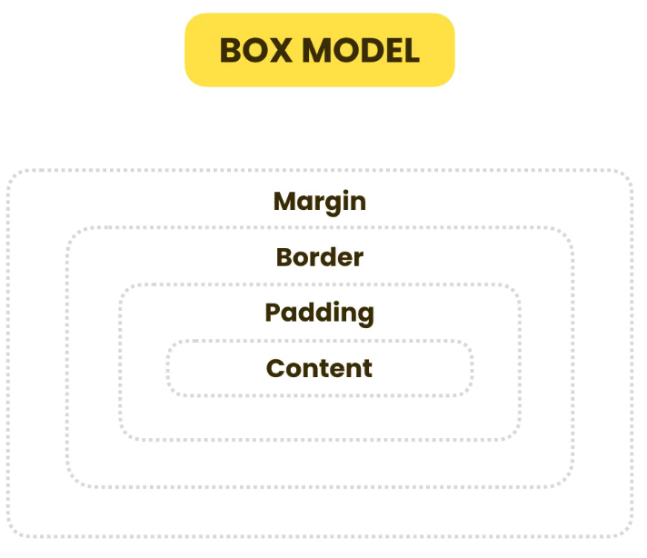
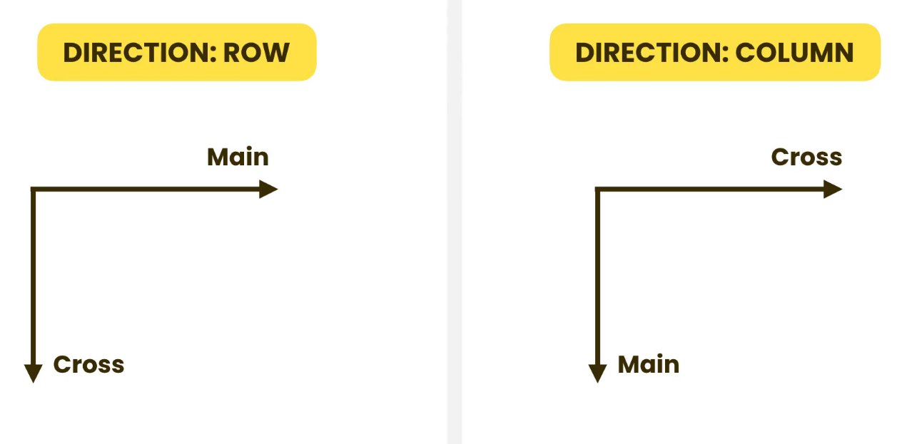

# Layout

[The box model](#the-box-model)  
[Sizing elements](#sizing-elements)  
[Overflowing](#overflowing)  
[Measurement units](#measurement-units)  
[Positioning](#positioning)  
[Floating elements](#floating-elements)  
[FlexBox](#flexbox)  
[Grid](#grid)  
[Hiding elements](#hiding-elements)  
[Media queries](#media-queries)  

## The box model

Whenever the browser renders an element it places it inside an invisible box. At the core of the box is the **content area**. This is were the elements content goes. Outside the content area we have the **padding**. This is the space between the content area and the **border** of the box. Around each box we have the **margin**.



We can use the CSS property `padding` to control the padding. This property takes up to 4 values that work the same way as the border property seen before. The same holds for the `margin`. But keep in mind that the browser will collapse the margins of elements that are next to each other, while it will not collapse the padding. Therefore, to avoid issues:

- use padding to separate the content and the border
- use margin to separate elements from each other

## Sizing elements

The width and height properties are applied to the content area. If we add padding or borders the total size of the element will increase. The margin property does not impact the size of the visible box as it relates to the space between elements.

This behavior is controlled by the `box-sizing` property. By default it's set to `content-box`. But if we set it to `border-box` the `height` and `width` properties will be applied to the `border-box` (that is, the padding and the border space will be included in there). With this, the values that we provide for border and padding will be subtracted from the `height` and `width` properties before calculating the content area. In general, the `box-sizing` property will be included in the universal selector `*`. This rule does not apply to pseudo-elements. To do so, we need to explicitly include them.

```css
*,
*::before,
*::after {
  box-sizing: border-box;
}
```

The `width` and `height` properties are only applied to block-level elements. Inline elements will not use them. To make them use it we need to set their `display` property to `inline-block`.

## Overflowing

Overflowing happens when the content of an elements doesn't fit inside the element. We can control it with the `overflow` property. By default, it's set to `visible`. If we change it to `hidden` the part of the content that overflows the container will not be seen. We can also set it to `scroll` to get a horizontal and vertical scroll bar in the container element. We can set the `overflow` property to `auto` to make the scroll bars only appear if there's overflow.

The `overflow` property is a short hand for `overflow-x` and `overflow-y`. We can set them separately if we want the *x* and *y* axis to have different behaviors. Or, we can supply two values to the `overflow` property which the browser will apply to x and y respectively.

## Measurement units

In CSS there are multiple units of measurement. They fall in either one of two categories: **absolute**, o **relative**. Absolute units are always fixed, while relative unites depend on something else. For example, percentages are relative to the size of the elements container (its parent element).

|    Absolute     |       Relative       | Relative to ...                      |
| :-------------: | :------------------: | :----------------------------------- |
|   px (pixel)    |    % (percentage)    | the size of the container            |
|   pt (point)    | vw (viewport width)  | the viewport                         |
|    in (inch)    | vh (viewport height) | the viewport                         |
| cm (centimeter) |          em          | the font size of the current element |
| mm (millimeter) |         rem          | the font size of the root element    |

`pt`, `in`, `cm`, and `mm` are mostly used for printing and have no real application for the web. We should use `px` when we don't want the size of something to change. With relative units, the size of our elements will change as the size of the element that determines their size changes.

By default, block-level elements have a width of 100% and a height of 0%. If there's content inside the element, the height will increase to fit the content.

For `em` and `rem` keep in mind that if no parent element has a font size, the font size of the `html` element will be used. By default, browsers give the `html` element a `font-size` of `16px`. So, a width of `10em` means 10 times the font size of the current element. On the other hand, `rem` will multiply based on the font size of the root element. This means that we don't have to trace back inheritance, the size will always be based on the `font-size` of the `html` element.

## Positioning

### Static positioning

By default, the `position` property of all elements is set to `static`, which means that it's not positioned, they appear exactly in their normal position.

### Relative positioning

If we set its position to `relative` we can position the element relative to its normal (`static`) position. Now we can use properties like `top`, `left`, `bottom`, and `right` to move the element around. For example, setting `left: 5rem;` will move the element 5 rem units to the right (because it will add 5rem units of space to its left). We can also use negative values to move the element the other way.

Moving the elements around will sometimes cause overlapping. Which element will be displayed in front of which depends on the elements position in the DOM. The element that comes last in the DOM will appear in front of the elements that come before it in the DOM. We can modify this behavior by setting the `z-index` property. This property is by default set to 0, but we can change it to positive values to make elements come forward, or to a negative value to make elements move backwards.

```css
.boxes {
  border: 3px solid lightgrey;
}

.box-two {
  background-color: tomato;
  position: relative;
  left: 5rem;
  bottom: 2rem;
  z-index: 999;
}
```

### Absolute positioning

With absolute positioning we can position an element relevant to its container. To do so, we need to first set the position of the parent element to `relative`.

```css
.boxes {
  border: 3px solid lightgrey;
  position: relative;
}

.box-two {
  background-color: tomato;
  position: absolute;
  right: 0;
  bottom: 0;
  z-index: 999;
}
```

Whenever we position an element with an `absolute` positioning, that element is removed from the normal flow of the page. This means that other block-level elements that come after it will be pushed up. From the parent's point of view, that element does not exist.

## Fixed

With `fixed` position we can position elements relative to the viewport. These elements will never leave the viewport and will always be shown. This is very commonly used for things like nav-bars.

```css
.box-two {
  background-color: tomato;
  position: fixed;
  top: 0;
}
```

## Floating elements

We use the `float` property to build layouts. Setting the `float` property of an element to `left` cause that element to float to the left of its container. As a consequence, the subsequent elements will float around it.

If we want to clear the floating of subsequent elements, we need to set the `clear` property to the same value as the `float` of the previous element. So, if we set `float: left;` in an element, then we need to set `clear: left;` in the sibling element that we want to prevent from floating. We can set `clear` to `both` to clear both floats.

By default, parent elements don't see floated elements. This may cause **parent collapsing**. One way of solving this is to add an empty `<div>` at the end of the collapsed parent and set its `clear` property. The problem with this approach is that this `<div>` is not semantic. We can instead solve the problem by using pseudo-elements. We need to target the `::after` pseudo-element of the parent element that we want to avoid collapsing. This pseudo-element does not need content, but it does need to be changed to `display: block;` so that it becomes a block-level element, and we need to clear the float as well.

```css
.clear-fix::after {
  content: "";
  display: block;
  clear: both;
}
```

Another solution is to set the `overflow` property of the collapsed element to any value other than `visible`. But this might cause other problems with our layouts.

Because of all this issues the use of floats is now discouraged over the use of FlexBox or Grid layouts.

## FlexBox

### Elements layout

FlexBox is used for laying out elements in one direction: `row` or `column`. To use FlexBox we need to set the `display` property to `flex`. The container element will still be a block-level element, but it will behave according to Flex rules in the inside. By default, the orientation will be `row`.

We control the direction of elements with the `flex-direction` property. Default is `row`, but we can change it to `column`, `row-reverse`, or `column-reverse`.

To align elements in Flex we need to understand the **axis**. FlexBox has two axes that depend of the `flex-direction` property:

- **Main** will be the horizontal axis if the direction is row, or the vertical axis if the direction is column
- **Cross** will be the vertical axis if the direction is row, or the horizontal axis if the direction is column



We use two properties in order to vertically and horizontally align items in FlexBox:

- `justify-content` is used to align items along the main axis
- `align-items` is used to align items along the cross axis

As we add more and more elements into the container, each element will become smaller and smaller while Flex tries to fix all elements in one row (or column). We can change this behavior using the `flex-wrap` property. Its default value is `nowrap`, but we can change it to `wrap` (amongst other possible values).

Now we can use the `align-content` property to align multiple lines (or even the entire content as a whole).

```css
.container {
  border: 3px solid lightgray;
  display: flex;
  flex-direction: row;
  justify-content: center;
  align-items: center;
  align-content: center;
  height: 90vh;
}
```

After we have built the layout of the container, we can layout its child elements. We can use the `align-self` property to move a child element to a different position inside the space assigned for it by the container.

``` css
.box-one {
  align-self: flex-start;
}
```

### Elements sizing

To size elements we use the following properties:

- `flex-basis` is used to set the initial size of a flex element. If we set the direction to `row`, then this property will targe the `width` property of the element, and, if direction is set to `column`, it will target the `height` property.
- `flex-grow` is used to set the growth factor of a flex element. The final size of elements is determined by adding all the growth factors and assigning each element the proportion of the available space that is equal to its contribution to the total growth factor.
- `flex-shrink` is used to set the shrink factor of a flex element. Same as before, but for shrinking elements.
- `flex` is a short hand property that combines all the previous ones (order is `flex-grow` `flex-shrink` `flex-basis`). If we supply a single value it will be used for the `flex-grow` property.

All these properties should be applied to flex elements, not to their container.

```css
.box {
  width: 5rem;
  height: 5rem;
  background-color: gold;
  margin: 1rem;
  flex-basis: 10rem;
  flex-grow: 1;
  flex-shrink: 0;
}

.box-one {
  align-self: flex-start;
  flex-basis: 5rem;
  flex-grow: 2;
  flex-shrink: 1;
}
```

## Grid

### Building a grid

We use Grid to layout elements in two dimensions. Just as with FlexBox, to build a Grid layout we need a container and its elements. In this container element we set the `display` property to `grid`, and then we use the `gird-template-rows` and `grid-template-columns` to define a template for rows and columns. To each of this properties we supply as many values (and units of measurement) as we want rows/columns to be there. If our columns or rows will have the same size, we can use the `repeat()` function and pass it a number of times to repeat and a size to be repeated.

```css
.container {
  display: grid;
  /* A 3 x 2 grid */
  grid-template-rows: repeat(3, 100px);
  grid-template-columns: repeat(2, 100px);
}
```

We can instead use the `grid-template` to specify a template for rows and a template for columns in one property. These values need to be separated with a forward slash, `/`.

```css
.container {
  display: grid;
  /* A 3 x 2 grid */
  grid-template: repeat(3, 100px) / repeat(2, 100px);
}
```

We can use the `width` and `height` properties to control the grid's size.

### Element alignment

By default, each element is aligned to the top left corner of its containing cell in the grid. To change alignment we use the following properties

- `justify-items` for aligning along the horizontal axis
- `align-items` for aligning along the vertical axis

```css
.container {
  display: grid;
  /* 3 x 2 */
  grid-template-rows: repeat(3, 100px);
  grid-template-columns: repeat(2, 100px);
  /* Align the items */
  justify-items: center;
  align-items: center;
}
```

If we want to align the grid itself we use

- `justify-content` to align the grid along the horizontal axis
- `align-content` to align the grid along the vertical axis

```css
.container {
  display: grid;
  /* 3 x 2 */
  grid-template-rows: repeat(3, 100px);
  grid-template-columns: repeat(2, 100px);
  /* Align the items */
  justify-items: center;
  align-items: center;
  /* Align the grid */
  justify-content: center;
  align-content: center;
}
```

If we want the elements in the grid to take up as much space as possible, we need to remove the `height` and/or `width` properties from their rules. With this we can set the `justify-items` and/or `align-items` properties to other values, for example, `stretch`, and the content will take up all the available space in the cell.

### Fractions

When building grids sometimes a row or column needs to take up a fixed amount of space and we want to distribute the remaining viewport or grid space among the remaining rows or columns. Here is where the fraction unit comes in handy. We can also use the `auto` keyword for letting the browser figure it out.

```css
.container {
  display: grid;
  grid-template: 100px auto 100px / 100px 30fr 70fr;
  height: 100vh;
}
```

### Gaps

If we want to leave space between the gird rows and/or column we use the *gap* properties (`gap`, `row-gap`, `column-gap`). If we use the short hand property, the values will be passed to row and columns respectively, or supply one value and the browser will repeat it.

```css
.container {
  display: grid;
  grid-template: 100px auto 100px / 100px 30fr 70fr;
  row-gap: 10px;
  column-gap: 10px;
  height: 100vh;
}
```

### Placing items

We have three properties to place elements in the grid: `grid-row`, `grid-column`, and `grid-area`. The last one is a short hand property for the first two (in that order). This properties need to be passed to items, not the container. This properties take numbers as their values and are filled from top-left to bottom-right by default. This numbers represent the row or columns lines where the item needs to start.

If we want an element to take up more than one cell, we need to specify the start and end lines separated by a forward slash, `/`. We can also count backwards, with the value `-1` representing the last line. We can also use the `span` keyword to specify how many cells the element should span.

```css
.box-one {
  grid-column: 1 / 3;
  grid-row: 2 / 4;
}
.box-two {
  grid-column: 1 / span 2;
}
```

The `grid-area` property takes four values separated by forward slashes that represent the `start - end`, in a `row / column` format. So, for example, `grid-area: 1 / 1 / 1 / 3` means that the element will start at row-one, column-one, and span all the way to row-one, column-three.

### Named areas

Another way of placing elements is by naming the areas using the `grid-template-areas` in the container element, and then assigning the `grid-area` property of each element to a particular cell name.

```css
.container {
  display: grid;
  grid-template: 100px auto 100px / 30fr 70fr;
  grid-template-areas:
    "header header"
    "sidebar main"
    "footer footer";
}
.box-one {
  grid-area: header;
}
.box-four {
  grid-area: footer
}
```

If we want a cell to be an empty area we use a period, `.`, in the grid template.

```css
.container {
  display: grid;
  grid-template: 100px auto 100px / 30fr 70fr;
  grid-template-areas:
    "header header"
    "sidebar main"
    ". footer";
}
```

## Hiding elements

One way of hiding elements is by setting its `display` property to `none`.

```css
.first {
  display: none;
}
```

A different way of doing it is by setting the `visibility` property to `hidden`.

```css
.first {
  visibility: hidden;
}
```

The difference between these two is that the `display` property hides the element as if it didn't exist in the first place. So all subsequent elements get pushed up. In contrast, the `visibility` property hides the element, but it reserves the place.

## Media queries

Media queries are used to provide different styles for different devices depending on the devices features. A very common use-case is changing the layout based on the screen size of the device. We call these websites **Responsive web sites** because they respond to different devices. The two main approaches to building responsive web sites are **desktop first** or **mobile first**. The most widely used approach is mobile first. The rationale behind this is that since mobile screens are smaller, you can build a basic web page that is good for mobile devices, and then add more content for larger screens.

A media query starts with `@media` and can have multiple parts. In each part we are asking something about the device. First we include either the key-word `screen` for devices, or `print` for printing. Then we are conditions between parenthesis. Usually these conditions are related to the screen size being wider than X pixels. If the query is true, then the styles defined inside the query will be applied, otherwise they will be ignored.

```css
@media screen and (min-width: 600px) {
  selector {
    rules: here;
  }
}
```

We can use media queries to set the styles for when printing. This will change the style when the user chooses to print our page.

``` css
@media print {
  body {
    font-size: 12pt;
  }
  .box {
    padding: 0.5cm;
  }
}
```