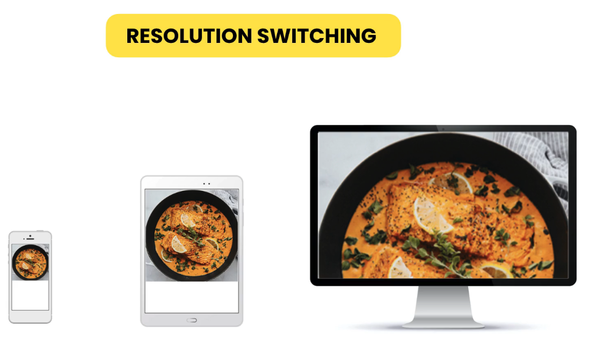
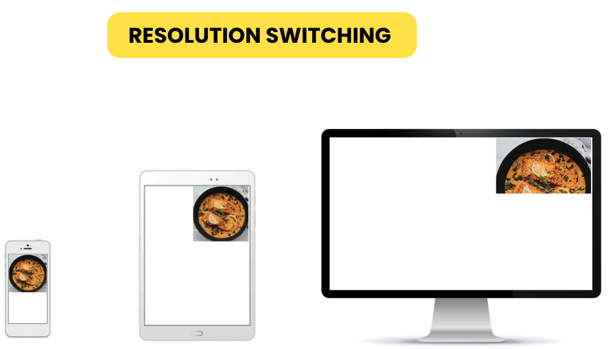

# Images

[Image types and formats](#image-types-and-formats)  
[Content images](#content-images)  
[Background images](#background-images)  
[CSS sprites](#css-sprites)  
[Data URLs](#data-urls)  
[Clipping](#clipping)  
[Filters](#filters)  
[Supporting high-density screens](#supporting-high-density-screens)  
[Resolution switching](#resolution-switching)  
[Using modern image formats](#using-modern-image-formats)  
[Art direction](#art-direction)  
[Scalable Vector Graphics (SVG)](#scalable-vector-graphics-svg)  
[Font icons](#font-icons)  

## Image types and formats

In computers we have two types of images:

1. **Raster** images are made up of pixels (photos)
2. **Vector** images which are defined by mathematical vectors (icons, logos)

Raster images can be computer-generated, but for the most part come from cameras. They use file extensions like `jpg`, `png`, `gif`, etc. Since they are made up of pixels, the larger the image, the larger the number of pixels and thus the larger the file size.

| Format | Colors | Transparency | Animation |
| :----: | :----: | :----------: | :-------: |
|  JPEG  |  16M   |      No      |    No     |
|  GIF   |  256   |     Yes      |    Yes    |
|  PNG   |  16M   |     Yes      |    Yes    |
|  WebP  |  16M   |     Yes      |    Yes    |

Vector images are computer-generated with software like Adobe Illustrator or other software that allows us to draw vectors. They are exported as `SVG` files. They always look sharp at any size (thus the Scalable is SVG).

## Content images

We add images in the HTML document with the `` element. The `src` attribute is the path to the file. The `alt` attribute needs to be set to a description of the image which the browser will display if the image cannot be loaded, and screen readers will read this description. If the image is purely decorative of the page, then we set the attribute to empty, `alt=""`. If we don't include the attribute at all, then screen readers will read the file name, which might confuse the user.

By default, images are rendered at their real size. We can control the image size with the `width` and `height` properties.

## Background images

We can apply background images to elements. To do so, we can either use the `background` or `background-image` properties. We use the `url()` function to specify the path to the image.

```css
body {
  background-image: url("images/file-name.jpg");
}
```

By default, the image will be repeated horizontally and vertically as many times as necessary to fill the viewport. This behavior is controlled by the `background-repeat` property. If we set it to `no-repeat` then the image will be shown once only at the top left corner. If we set it to `repeat-x` or `repeat-y` then the image will only be repeated along the horizontal or vertical axis respectively.

```css
body {
  background-image: url("images/file-name.jpg");
  background-repeat: no-repeat;
}
```

To control the position of the image we use the `background-position` property. We need to pass two values: `horizontal-adjustment` and `vertical-adjustment`. These values can be either positive or negative. A positive `horizontal-adjustment` will move the image to the right, and a negative to the left. Likewise, a positive `vertical-adjustment` value will move the image up, and a negative down. It's usually recommended to use relative units. For example, 100% will move the image to the opposite side of its parent container (along the respective axis).

```css
body {
  background-image: url("images/file-name.jpg");
  background-repeat: no-repeat;
  background-position: 100% -100%;
}
```

To control the size of the image, we use the `background-size` property and supply two values: `width` and `height`. If we set a value to 100% is will take up all the space in its container. Be aware the if we set the image height to 100% for an empty block-level container, it will disappear. This is because, by default, the height of a block-level element is the necessary hight to accommodate it's content, and since the container is empty, its height is zero. If we want the image to be a cover image (cover the entire container will keeping its aspect ratio), we can set this property to `cover`.

```css
body {
  height: 100vh;
  background-image: url("images/file-name@2x.jpg");
  background-repeat: no-repeat;
  background-position: 100px 100px;
  background-size: cover;
}
```

We can make our background image stay fixed (relative to the viewport) while the content is scrolled by setting the `background-attachment` property to `fixed`. With this, the image will only be expanded to fill 100% of the viewport and it will not be stretched that much (or at all, depending on the image).

```css
body {
  height: 300vh;
  background-image: url("images/file-name.jpg");
  background-repeat: no-repeat;
  background-position: 100px 100px;
  background-size: 100% 100%;
  background-attachment: fixed;
}
```

## CSS sprites

If we have a page with multiple images, each time each user requests each image a request is sent to the server. We can use CSS Sprites to optimize these requests. We can combine all images into a single image and then get that image with a single HTTP request. To generate the sprites we can use any online sprite generator (like [here](https://www.toptal.com/developers/css/sprite-generator/)). The generator generates a `png` file with all our images and the CSS classes to use them.

Now we can add the images using `<span>` elements instead of `` elements. The images are applied as a background image. Each span needs to have the class that matches the class in the CSS that corresponds to that image.

```html
<span class="bg-name-of-icon-1"></span>
<span class="bg-name-of-icon-2"></span>
<span class="bg-name-of-icon-3"></span>
```

```css
.bg-name-of-icon-1 {
  width: 100px;
  height: 100px;
  background: url("images/css_sprites.png") -4px -4px;
  display: inline-block;
}

.bg-name-of-icon-2 {
  width: 100px;
  height: 100px;
  background: url("images/css_sprites.png") -112px -4px;
  display: inline-block;
}

.bg-name-of-icon-3 {
  width: 100px;
  height: 100px;
  background: url("images/css_sprites.png") -220px -4px;
  display: inline-block;
}
```

Don't include large images in sprites, only logos and icons.

## Data URLs

This is another optimization technique to reduce the number of HTTP requests. It's formerly known as Data URIs. Data is just another protocol that is used to represent a binary file as a sequence of characters. The data URI is passed as the `src` attribute of the `` element. It starts with `data`, which is just the protocol. Then, separated by a colon `:`, comes `image/png` which specifies the type of data we are representing. After that comes a semi-colon `;`, followed by the actual data.

``` html

```

Now the image is embedded into the HTML document. Therefore, the browser did not have to send an HTTP request to get it.

Problems with this approach include:

- size of the embedded code is always larger that the size of the original resource.
- increased complexity, as each data URL needs to be generated.
- slow on mobile.

## Clipping

In CSS we can easily clip, or cut, a part of an image. To do so we need to generate a clip path. One tool to produce such paths is [Clippy](https://bennettfeely.com/clippy/). This online tool will generate the value that we need to use for the `clip-path` property of the image element.

``` css
img {
  clip-path: polygon(0% 20%, 60% 20%, 60% 0%, 100% 50%, 60% 100%, 60% 80%, 0% 80%);
}
```

## Filters

In CSS we can add filters to our images like: `grayscale`, `blur`, `contrast`, `brightness`, and so on. All of the are implemented with a function that is passed to the `filter` property. For example, if we want to apply a 70% gray-scale filter we use:

```css
img {
  filter: grayscale(70%);
}
```

We can also apply more than one filter. To do so we just pass the different function one after the other:

```css
img {
  filter: grayscale(70%) blur(3px);
}
```

Filters can also be triggered by pseudo-classes like `:hover`.

```css
img:hover {
  filter: grayscale(70%) blur(3px);
}
```

A complete list of filtering functions can be found in the [MDN Web Docs](https://developer.mozilla.org/en-US/docs/Web/CSS/filter).

## Supporting high-density screens

Screens areas are measured in **pixels**. We can think of pixels are little squares of screen area. When we say that, for example, an iPhone 3 has a 480x320 screen we are saying that the screen of such devices is 480 pixels in height and 320 pixels in width. Later on, the iPhone 4 was launched. It had a 960x640 screen, but the same physical size. What Apple had done was to reduce the size of each pixel (i.e. each square in the screen) to half its size. Apple called this new high-density screens *Retina* displays.

In order to display images on these devices, a scale factor was introduced. So, when the scale factor is, for example, `2x` all images are displayed at twice the logical `width` that we supply in our CSS. This means that a 320x320 image takes as much screen space in an iPhone 4 than in an iPhone 3, despite the later having twice the number of pixels.

The problem is that when raster images are scaled up they blur up, as the browser needs to generate more pixels. To solve this issue we need to provide multiple versions of our image at different scale factors that will all then be displayed at the original size.

Some technical definitions:

- **Physical resolution**: the actual number of pixels in the device's screen. For example, iPhone 4 has a physical resolution of 960x640.
- **Logical resolution**: the behavior resolution. This is the resolution that CSS uses. For example, iPhone 4 has a logical resolution of 480x320.
- **Device pixel ratio (DPR)**: the ratio between physical to logical pixels. Any scree with DPR > 1 is considered a high-density screen. For example, iPhone 4 has a DPR of 2.

When generating the different versions of our images it's customary to name each file following this rule:

- The original image is appended `-full`. For example, if we have an image called of a dish, we can call it `meal-full.jpg`.
- The image at `1x` gets the base name only. For example, `meal.jpg` stays as `meal.jpg`.
- Each enlarged image is names with the same name as the original but `@fx` gets appended, where `f` is the factor. For example, the version of `meal.jpg` that was enlarged by a factor of 2 will be called `meal@2x.jpg`. Likewise, the `3x` version of the image file will be named `meal@3x.jpg`, and so on.

We never generate all possible DPRs (there is an infinite amount of them anyways). Usually, we generate the `1x`, `2x`, and `3x` version of the images. To do so we can use PhotoShop or other online tools. When generating such images we start from the `-full` version. First we generate the largest version that we want, say `3x`. Then we go down one step at the time, for example, generating the `2x` version, and lastly the `1x` version. This is because if we first reduced it to `1x`, then to generate the `2x` version, our software will have to create new pixels and the image will get blurred. Of course, an alternative is to always start from the `-full` version, but this might require us to close and re-open the software in every step.

When selecting the size, keep in mind that we are always specifying logical pixels. So, if we want our image to be displayed at 400 logical pixels, then the `3x` physical version of the image needs to be 1200 pixels. Keep in mind that, for our example, the `-full` version of our image needs to be greater than 1200 pixels.

In the HTML document, we start by adding the base version of our image to the `src` attribute of the `` element. Then we use the `srcset` attribute to provide the different versions. Here we'll create a list of comma separated values. Each value is the path to the file followed by a space and the version of the image. The browser will select the appropriate version of the image based on the screen DPR in the user's device.

```html

```

When testing our page in different devices, we can use Chrome DevTools to check which version of the image was used in different devices. This technique is for fixed sized images.

## Resolution switching

Sometimes we need to display images at a constant relative unit in different devices (for example, a background image that needs to fill the entire viewport).



We cannot provide all possible sizes, but we can provide three or four of them and then instruct the browser how to pick the image that is best for the screen the user is using. The way to do this is to change the units in our HTML mark-up. The `w` unit is telling the browser that that version of the image is 400 pixels wide, or 800 pixels wide, etc.

```html

```

```css
img {
  width: 100vw;
}
```

Now suppose we want the space taken by the image to vary based on the size of the screen. For example, we might want the image to take up the entire screen width on mobile devices, half the screen in tablets, and one-third in desktops.



We don't use media queries to implement this because the browser's decision will be impacted by the width that we apply to the image. Instead, we are use the `sizes` attribute of the `` element. Each row in the `sizes` list can start with a **media condition**. In this example, we are telling the browser that if width of the viewport is 500px or less, then the image should be displayed at 100vw (the entire width of the screen), if it's between 500px and 700px, then the image should be displayed at 50vw (half the width of the screen), otherwise it should be displayed at 33vw (one third of the screen).

```html

```

We don't need to provide all this code ourselves. We can use tools like [Responsive Breakpoints](https://www.responsivebreakpoints.com/) to do it for us.

## Using modern image formats

WebP is a modern image format. We can convert images to WebP using online tools like [Cloud Convert](https://cloudconvert.com/). Images in WebP format are much smaller than `png` or `jpg`. Once we've converted our image to WebP we can use the `` element to insert it into our markdown.

``` html

```

In order to support users using browsers that don't support the WebP image format we need to use the `<picture>` element. Inside this element we are going to use two `<source>` elements and one `` element. The `<source>` elements describe the `type` of picture we are trying to load (`image/webp` for WebP images, and `image/jpeg` for jpg images) as well as the `srcset` that should be used for supporting high-density screens. Then we supply an `` element. This element is important since not all browsers support the `<picture>` and/or `<source>` elements yet, and for supplying the images `alt` attribute.

```html
<picture>
  <source
    type="image/webp"
    srcset="
      images/file-name.webp    1x,
      images/file-name@2x.webp 2x,
      images/file-name@3x.webp 3x
    "
  />
  <source
    type="image/jpeg"
    srcset="
      images/file-name.jpg    1x,
      images/file-name@2x.jpg 2x,
      images/file-name@3x.jpg 3x
    "
  />
  
</picture>
```

## Art direction

Some times we want to show a zoomed-in or cropped-up version of an image for certain screen sizes. This is called **Art Direction**. to implement Art Direction we use the `<picture>` element. In the `<source>` element we use the `media` attribute to pass the necessary media conditions. For example, we can tell the browser that, for screens of up to 500px the cropped version of the image needs to be used, and for screens for more than 501px the base image should be used.

```html
<picture>
  <source media="(max-width: 500px)" srcset="images/file-name-cropped.jpg" />
  <source media="(min-width: 501px)" srcset="images/file-name.jpg" />
  
</picture>
```

We can also supply multiple versions of the image for high-density screens.

## Scalable Vector Graphics (SVG)

SVG images are generated by mathematical functions. They are made out of vectors that can be scaled up or down as needed without loosing their quality. They are commonly used for icons and logos, or even for background images (you can find some in [SVG Backgrounds](https://www.svgbackgrounds.com/)). To add an SVG image we just the same `` element and set its `src` attribute to a `.svg` file.

```html

```

SVG files are very small compared to their raster counterparts and almost all browsers support them.

## Font icons

Some of the most commonly used icon sets are

- [Font Awesome](https://fontawesome.com/)  
- [Ionicons](https://ionic.io/ionicons)  
- [Material Design Icons](https://materialdesignicons.com/)  
- [Simple Icons](https://simpleicons.org/)  

To use Font Awesome first you need to generate a Kit in their web-page. By default, the kit name will be an alpha-numerical sequence, but you can change it. Once the kit is generated, you need to add the provided script in the `<head>` element of your HTML document.

```html
<head>
  <script src="https://kit.fontawesome.com/kit-name.js" crossorigin="anonymous"></script>
</head>
```

Then we can add icons to the body of our document by copying and pasting the code snippets that Font Awesome provides.

```html
<body>
  <i class="fas fa-user-friends"></i>
  <i class="fas fa-bell"></i>
</body>
```
```html
<body>
  <i class="fas fa-user-friends"></i>
  <i class="fas fa-bell"></i>
</body>
```

FA provides some utility classes to modify the icons. For example, if we add the class `fa-2x` our icon will be twice as large, relative to the font size of its parent element.

```html
<body>
  <i class="fas fa-user-friends fa-2x"></i>
  <i class="fas fa-bell"></i>
</body>
```

To get better control of how the icons are displayed, we can wrap them in `<span>` elements and provide CSS rules for them. Other rules like color are also inherited.

```html
<span class="icon">
  <i class="fas fa-user-friends"></i>
</span>
```

If you don't want to use the `<i>` element for icons (since it's non-semantic), you can also use the `<span>` element instead.

```html
<span class="icon">
  <span class="fas fa-bell"></span>
</span>
```
